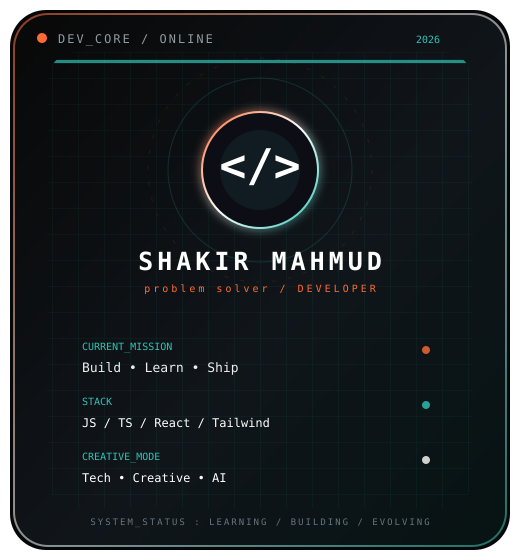

<div align="center">



<br/><br/>

## 🎬 About Me



```yaml
name: Shakir Mahmud
location: Jamalpur, Bangladesh
languages.real: English, Bangla
role: Full Stack Web Developer (Learning)
currently_learning: HTML · CSS · JavaScript · TypeScript · Git/GitHub · React ·
                    Tailwind CSS
also_into:
  - 📷 Photography & Cinematic Photo/Video Editing
  - 🤖 AI Tools & Experimentation
  - 🍫 Traveler
fun_fact: "I edit frames before I edit code."

```

<br clear="right"/>

## 🛠️ Languages & Tools


<br/><br/>


<!-- ══════════════════════════════════════════════ -->
<!-- GITHUB ANALYTICS DASHBOARD -->
<!-- ══════════════════════════════════════════════ -->

<!-- ── Analytics Section Header (decorative banner) ── -->


<!-- ── ROW 1: Summary Dashboard Cards (real-time) ── -->

<br/>

<!-- ── ROW 2: Repos by Language + Most Commit Language + Stats ── -->
<table width="100%">
  <tr>
    <td width="33%" align="center">
      
    </td>
    <td width="33%" align="center">
      
    </td>
    <td width="33%" align="center">
      
    </td>
  </tr>
</table>
<br/>

<!-- ── ROW 4: Streak (centered) ── -->
<p align="center">
  
</p>
<br/><br/>
<!-- ═══════════════════════════════════════════════════════════ -->


<!-- ═══════════════════════════════════════════════════════════ -->
## 📫 Connect With Me

<a href="mailto:shakirmahmud.co@gmail.com">
  
</a>
<a href="https://shakir901.github.io/portfolio-/" target="_blank">
  
</a>
<a href="https://github.com/shakir4mahmud" target="_blank">
  
</a>
<a href="https://www.facebook.com/Shakir.x.01" target="_blank">
  
</a>
<a href="https://www.instagram.com/exotic.shakir/" target="_blank">
  
</a>

<br/><br/>

<sub>Captured with Vision. Crafted with Code.</sub>

</div>
